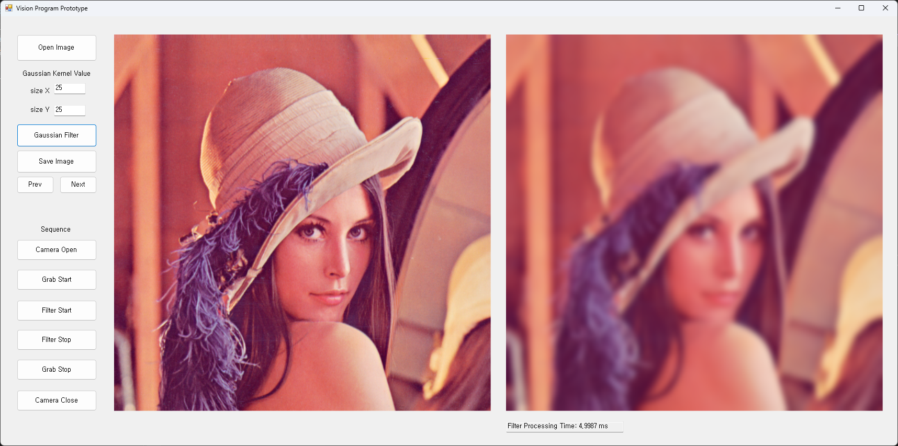

# Vision Program Prototype

본 프로젝트는 **.NET Framework 4.8** 및 **OpenCV(OpenCvSharp)** 를 기반으로 한 **C# WinForms 영상처리 프로그램**입니다.
사용자가 이미지를 불러오고, Gaussian 커널 사이즈를 조절하여 필터를 적용할 수 있습니다.

---

## 🖼️ UI 구성



### 기본 동작
- Open Image 버튼 클릭 후 이미지 파일 선택
- Gaussian 필터 커널 사이즈 지정 (예: X=25, Y=25)
- Gaussian Filter 클릭 → 필터 적용 결과 출력
- Save Image 클릭 → 결과 저장

### Sequence
- Camera Open → 카메라 열기
- Grab Start / Grab Stop → 이미지 캡처 시작/중지
- Filter Start → 실시간 필터 적용 시작
- Filter Stop → 필터 적용 중지
- Camera Close → 카메라 종료

---

## 🧩 주요 기능

- 이미지 파일 불러오기 및 저장
- Gaussian 필터 적용 (커널 크기 지정 가능)
- 필터 처리 시간(ms) 측정 및 표시
- 카메라 연동: 영상 캡처 및 필터 적용
- 이미지 탐색 (Prev/Next 버튼)

---

## 🛠️ 개발 환경

- **언어**: C#
- **프레임워크**: .NET Framework 4.8
- **GUI**: Windows Forms
- **라이브러리**: [OpenCvSharp4.Windows](https://www.nuget.org/packages/OpenCvSharp4.Windows/) (NuGet)

---

## ⚙️ 설치 및 실행 방법

### 1. 사전 요구 사항

- Windows 10 이상
- Visual Studio 2019 이상
- .NET Framework 4.8 Developer Pack 설치

### 2. 실행 절차

```bash
# 저장소 클론
git clone [https://github.com/your-username/vision-program-prototype.git](https://github.com/woosmile/OpenCV_Image_Processing.git)

# Visual Studio로 솔루션 열기
# NuGet 패키지 복원 후 빌드
